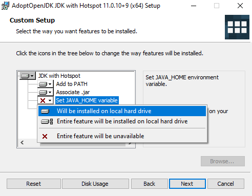

# Java

Este documento tem como objetivo facilitar o aprendizado da linguagem Java, dando uma ordem para o aprendizado dos conceitos.

## Pré requisitos

### Instalar a JDK

Acesse o site e faça o download da OpenJDK 11 (LTS):
```
https://adoptium.net/
```

Execute a instalação, basicamente next > next > next.... 

Na etapa de Custom Setup, adicione a feature para definir a variável JAVA_HOME, como na imagem abaixo:



Após isso, siga com a instalação next > next > next....

Após finalizar, reinicie o computador.

Quando o computador iniciar novamente, abra o PowerShell e execute os comandos.

```
java -version
javac -version
```

Você deve ver retornos nos 2 comandos.
